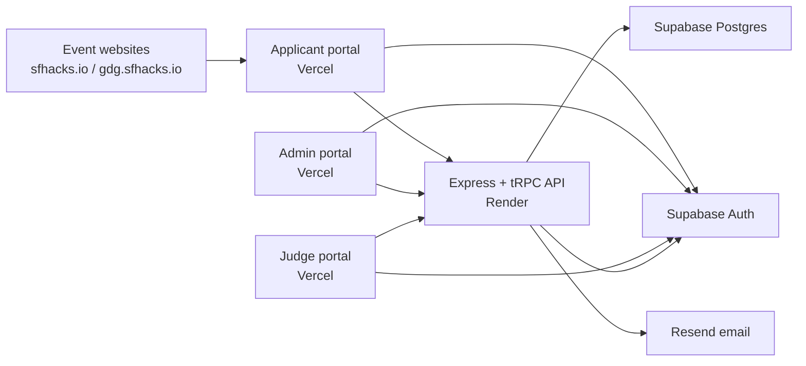

# SF Hacks Event Manager

The shared application, administration, judging, and event-day platform for SF Hacks events.

This repository is separate from the public event websites:

- [sfhacks.io](https://sfhacks.io) is the main SF Hacks website.
- [gdg.sfhacks.io](https://gdg.sfhacks.io) is the SF Hacks × GDG event website.
- [app.sfhacks.io](https://app.sfhacks.io) is the shared participant application portal.
- [admin.sfhacks.io](https://admin.sfhacks.io) is the organizer portal.

The public websites send applicants to the participant portal. The active event is selected by an event UUID, so the same portals and Supabase project can safely support the GDG event, SF Hacks 2027, and future events without deleting earlier data.

## System overview



| Component        | Directory                      | Responsibility                                                                                |
| ---------------- | ------------------------------ | --------------------------------------------------------------------------------------------- |
| API              | `app/api`                      | Express, tRPC, Prisma, authorization, application decisions, email, QR check-in, judging      |
| Applicant portal | `app/applicant-portal`         | Authentication, profile, application form, team management, application status, check-in pass |
| Admin portal     | `app/admin-portal`             | Application review, decision emails, check-in, judging setup, announcements                   |
| Judge portal     | `app/judge-portal`             | Assigned submissions and rubric scoring                                                       |
| Database         | `app/api/prisma/schema.prisma` | The source of truth for the Postgres data model                                               |

The frontends call `/trpc`. In production, each Next.js app rewrites that path to the API origin configured by `API_ORIGIN`. Every request includes the signed-in user's Supabase access token and the active `x-event-id` header.

## How an application works

1. A participant signs in through Supabase Auth.
2. They create a shared `user_profiles` record.
3. The application portal sends the configured `NEXT_PUBLIC_EVENT_ID` with every API request.
4. Submitting the form creates an `applications` row for that user and event. A user can have one application per event.
5. The API also creates the participant's event profile and initial team records.
6. Resend emails the organizer configured in `ORGANIZER_NOTIFICATION_EMAIL` about the new application.
7. An organizer reviews the application in the admin portal and sets it to pending, accepted, rejected, or waitlisted.
8. The API updates the status, sends the matching email, and records the delivery result in `email_logs`.

Applications and related records are never selected globally. They are filtered by `event_id`, which prevents one event's applicants from appearing in another event's portal.

## Acceptance emails and QR check-in

When an organizer accepts an applicant, the API:

1. Creates an HMAC-signed check-in token containing the event ID and user ID.
2. Renders that token as a PNG QR code.
3. Sends the acceptance email through Resend with an inline QR and a downloadable `SF-Hacks-check-in-pass.png` attachment.
4. Makes the same pass available in the participant dashboard.

At the venue, an organizer scans the QR in the admin portal. The API verifies its signature, confirms that it belongs to the active event, checks the applicant's acceptance status, and records `checked_in` and `checked_in_at`. Repeated scans report that the participant is already checked in instead of creating another record.

`CHECKIN_QR_SECRET` must be at least 32 characters and must stay unchanged for the event. Changing it invalidates QR passes created with the previous secret.

## Multiple events in one database

The project is intentionally multi-event. The `events` table owns or scopes applications, event roles, teams, submissions, rubrics, email templates, email logs, announcements, and check-ins.

To move a portal from the GDG event to SF Hacks 2027:

1. Keep the GDG event and its records in Supabase.
2. Copy the SF Hacks 2027 UUID from the `events` table.
3. Change `NEXT_PUBLIC_EVENT_ID` in the relevant Vercel projects.
4. Redeploy those projects because `NEXT_PUBLIC_*` values are included at build time.
5. Give organizers and judges an `event_profiles` role for the new event.

No database reset or application deletion is required. Historical GDG data remains available by its original event ID and can be exported later from Supabase as CSV.

> Changing an event ID changes which event the portal displays; it does not move existing applications between events.

## Authentication and roles

Supabase Auth verifies the user. The API then reads `event_profiles` to authorize event-specific actions.

| Role        | Access                                                                                  |
| ----------- | --------------------------------------------------------------------------------------- |
| `hacker`    | Own application, team, status, and accepted check-in pass                               |
| `judge`     | Assigned projects and scoring                                                           |
| `organizer` | Application decisions, check-in, judging administration, email tools, and announcements |

Organizer access is event-scoped, not email-global. To make the same account an organizer for every event, create one organizer `event_profiles` row for that profile and each event:

```bash
cd app/api
node scripts/make-organizer.mjs <profile-uuid> <event-uuid>
```

Run the command again with each additional event UUID. The account must first sign in and have a matching `user_profiles` record.

## Hosting and deployment

The current production layout is:

| Service               | Platform                | Important configuration                                                |
| --------------------- | ----------------------- | ---------------------------------------------------------------------- |
| Public event websites | Vercel + Cloudflare DNS | The Apply button links to the applicant portal                         |
| Applicant portal      | Vercel                  | Supabase public values, event ID, base URL, API origin                 |
| Admin portal          | Vercel                  | Supabase public values, event ID, API origin                           |
| Judge portal          | Vercel                  | Supabase public values, event ID, API origin                           |
| API                   | Render                  | Database, Supabase service key, Resend, CORS, mode controls, QR secret |
| Auth and database     | Supabase                | Auth users and Postgres data                                           |
| Transactional email   | Resend                  | Verified `sfhacks.io` sending domain                                   |
| DNS                   | Cloudflare              | Routes the `sfhacks.io` subdomains to Vercel or the intended service   |

Pushing to `main` deploys services only when automatic deployments are enabled. After an API change, confirm that Render is running the newest commit. A successful Vercel deployment alone does not update the backend.

### Vercel variables

Configure these separately for each frontend project.

| Variable                        | Used by                | Purpose                                                        |
| ------------------------------- | ---------------------- | -------------------------------------------------------------- |
| `NEXT_PUBLIC_SUPABASE_URL`      | All portals            | Supabase project URL                                           |
| `NEXT_PUBLIC_SUPABASE_ANON_KEY` | All portals            | Browser-safe Supabase anonymous key                            |
| `NEXT_PUBLIC_EVENT_ID`          | All portals            | UUID of the event shown by that deployment                     |
| `API_ORIGIN`                    | All portals            | Render API origin used by the server-side `/trpc` rewrite      |
| `NEXT_PUBLIC_BASE_URL`          | Applicant portal       | Public applicant portal URL, normally `https://app.sfhacks.io` |
| `BACKEND_PORT`                  | Local development only | Local API port, normally `4000`                                |

Because the event ID is public routing configuration, it is safe to use the `NEXT_PUBLIC_` prefix. Never put the Supabase service-role key, database URL, Resend key, or QR secret in a `NEXT_PUBLIC_` variable.

### Render API variables

| Variable                        | Purpose                                                            |
| ------------------------------- | ------------------------------------------------------------------ |
| `DATABASE_URL`                  | Pooled Postgres connection used by Prisma at runtime               |
| `DIRECT_URL`                    | Direct Postgres connection used by Prisma operations               |
| `SUPABASE_URL`                  | Supabase project URL used by the server                            |
| `SUPABASE_SERVICE_ROLE_KEY`     | Server-only key for trusted Auth administration                    |
| `RESEND_API_KEY`                | Resend API credential                                              |
| `RESEND_FROM_ADDRESS`           | Verified sender, for example `SF Hacks <notifications@sfhacks.io>` |
| `ORGANIZER_NOTIFICATION_EMAIL`  | Receives one notification per submitted application                |
| `ADMIN_PORTAL_URL`              | Link placed in organizer notification emails                       |
| `PARTICIPANT_PORTAL_URL`        | Dashboard link placed in participant emails                        |
| `ADDITIONAL_CORS_ORIGINS`       | Comma-separated production frontend origins                        |
| `APPLICATION_STATUS_MODE`       | `test` or `live`; controls real decision changes                   |
| `APPLICATION_STATUS_TEST_EMAIL` | Optional safe recipient while status mode is `test`                |
| `CHECKIN_MODE`                  | `test` or `live`; controls whether scans record attendance         |
| `CHECKIN_QR_SECRET`             | Stable random signing secret of at least 32 characters             |
| `PORT`                          | Supplied by Render; the server reads it automatically              |

Use `APPLICATION_STATUS_MODE=live` when decisions should update applications and send to the actual applicants. Use `CHECKIN_MODE=live` only when scans should record attendance. Both default safely to `test` when missing or invalid.

After changing Render variables, choose **Save, rebuild, and deploy**. Environment changes do not affect an already-running build until the service redeploys.

## Local development

Requirements: Node.js 20 or newer, npm, and access to the development Supabase project.

```bash
npm install

cp app/api/.env.example app/api/.env
cp app/applicant-portal/.env.example app/applicant-portal/.env.local
cp app/admin-portal/.env.example app/admin-portal/.env.local
cp app/judge-portal/.env.example app/judge-portal/.env.local
```

Fill in the copied files, then start the services in separate terminals:

```bash
npm run dev:api          # http://localhost:4000
npm run dev:applicant    # http://localhost:3000
npm run dev:admin        # http://localhost:3001
npm run dev:judge        # http://localhost:3002
```

The local API loads `app/api/.env.test-mode` after `.env` outside production. This keeps test controls separate from production credentials.

## Common operations

### Create an event

`seed-event.mjs` currently creates an SF Hacks 2027 event. Review its event name and settings before running it:

```bash
cd app/api
npm run seed:event
```

Copy the UUID printed by the script into the portals' `NEXT_PUBLIC_EVENT_ID` values.

### Import schools

The importer trims and de-duplicates names and skips schools that already exist:

```bash
cd app/api
npm run seed:schools -- /absolute/path/to/schools.txt
```

### Export one event's applications

In Supabase Table Editor, open `applications`, filter `event_id` to the desired event UUID, and export the filtered rows as CSV. Keep the event record in place so its applications, email logs, check-in history, and judging data retain their relationships.

### Run verification

```bash
npm test
npm run build
```

For a faster API-only check:

```bash
npm test --workspace=app/api
npm run build --workspace=app/api
```

## Production checklist

- Confirm every Vercel portal uses the intended `NEXT_PUBLIC_EVENT_ID`.
- Confirm every portal's `API_ORIGIN` points to the live Render API.
- Add all production portal origins to `ADDITIONAL_CORS_ORIGINS`.
- Keep `SUPABASE_SERVICE_ROLE_KEY` and `CHECKIN_QR_SECRET` server-only.
- Verify `sfhacks.io` in Resend and use that domain in `RESEND_FROM_ADDRESS`.
- Give each organizer an `organizer` event profile for the active event.
- Test one application submission and confirm the organizer email arrives.
- Test pending → accepted and confirm the applicant receives the QR attachment.
- Verify the participant dashboard can reveal the same QR.
- Keep decision and check-in modes in `test` until their real actions are intended.
- On event day, set `CHECKIN_MODE=live`, redeploy the API, and test one scan.

## Troubleshooting

### The admin portal opens but shows forbidden or participant data

Confirm that the signed-in Supabase user has a `user_profiles` record and an `event_profiles` row with role `organizer` for the exact `NEXT_PUBLIC_EVENT_ID` used by the admin deployment. Sign out and back in after changing access.

### A portal shows the wrong event

Update `NEXT_PUBLIC_EVENT_ID` in that Vercel project and redeploy it. Changing the Supabase `is_event_live` field does not replace the event ID embedded in the frontend build.

### Vercel builds but API requests fail

Check `API_ORIGIN`, the Render service status, and `ADDITIONAL_CORS_ORIGINS`. The Next.js fallback points to localhost and is only suitable for local development.

### Status changes but email fails

Check the matching row in `email_logs`, then verify `RESEND_API_KEY`, `RESEND_FROM_ADDRESS`, and the Resend domain status. The sending domain must be verified; a Gmail address cannot be used as a custom Resend sending domain.

### Acceptance email arrives without a QR

Confirm that Render deployed a commit containing the QR email code, not only that Vercel deployed. Then send a new accepted decision and expand the newest message in Gmail. It should contain an inline QR and `SF-Hacks-check-in-pass.png`.

### QR modal says the secret is missing

Set `CHECKIN_QR_SECRET` on Render to a random value of at least 32 characters, rebuild the API, and generate a new pass. Preserve that value for the duration of the event.

## Security notes

- Browser applications receive only the Supabase anonymous key. The service-role key stays on the API server because it bypasses Row Level Security.
- The API validates Supabase access tokens and performs event-role authorization before organizer and judge operations.
- Event IDs scope data but are not secrets and are not a substitute for authorization.
- QR payloads are signed and event-bound; the scanner never trusts an unsigned user or event ID.
- Keep Row Level Security enabled with ownership-based policies for tables exposed through the Supabase Data API.
- Do not commit `.env`, `.env.local`, service keys, database passwords, or Resend credentials.

## Additional project docs

- [ROADMAP.md](./ROADMAP.md) tracks remaining product work.
- [CONTRIBUTING.md](./CONTRIBUTING.md) explains contribution and review conventions.
- [app/api/prisma/schema.prisma](./app/api/prisma/schema.prisma) is the authoritative data model.

## License

MIT — see [LICENSE](./LICENSE).
